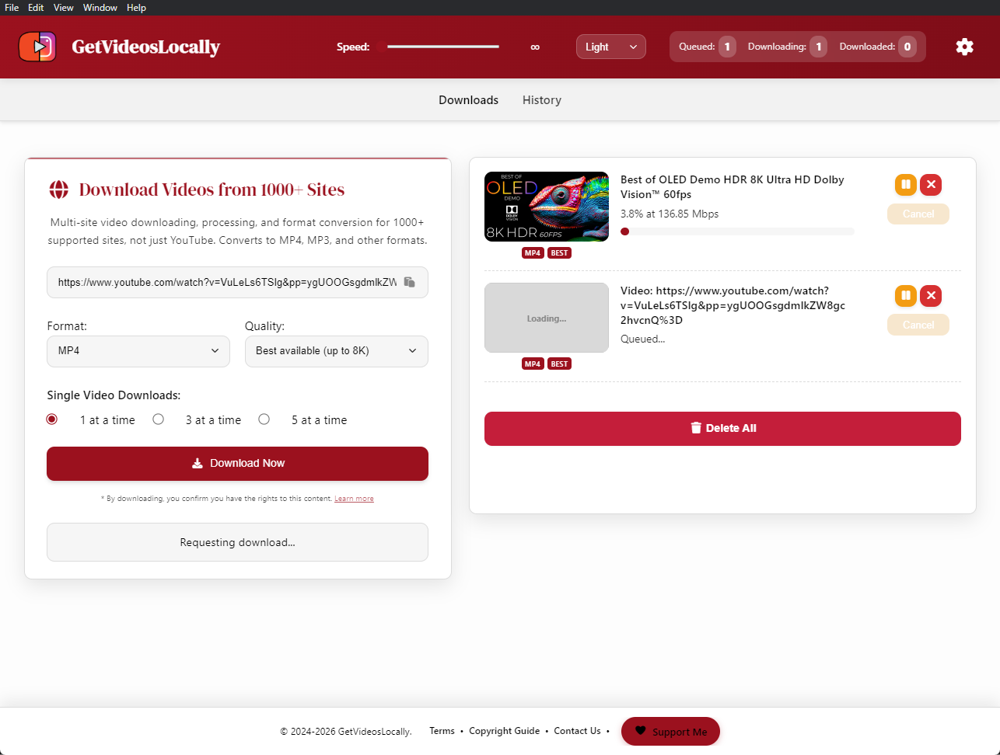
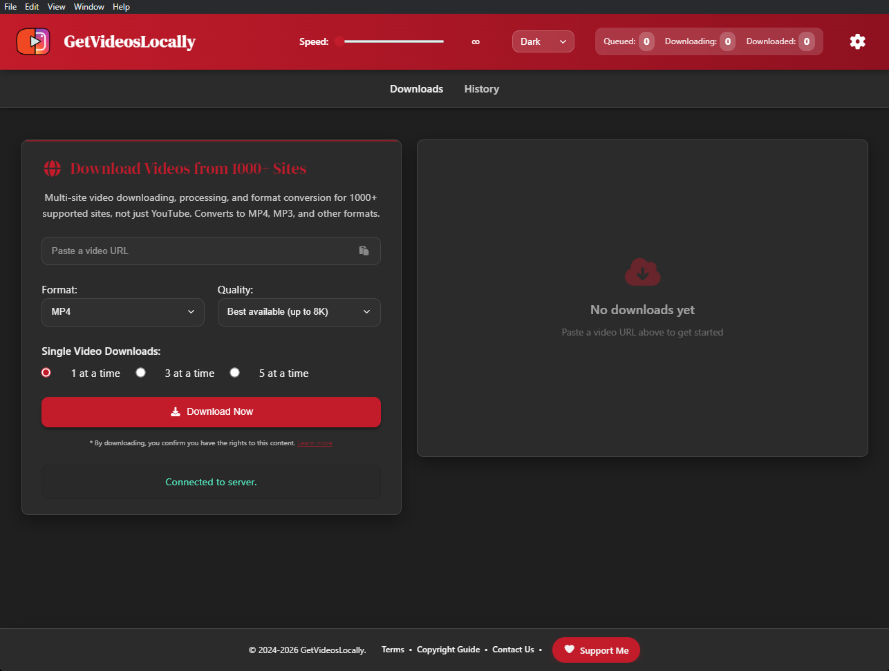
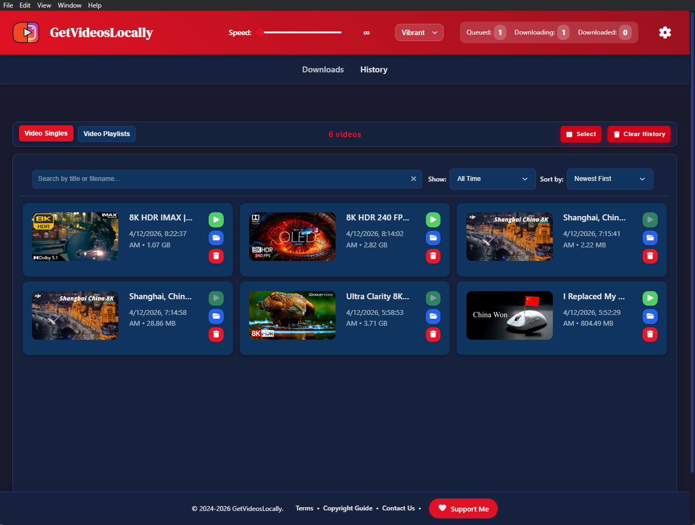
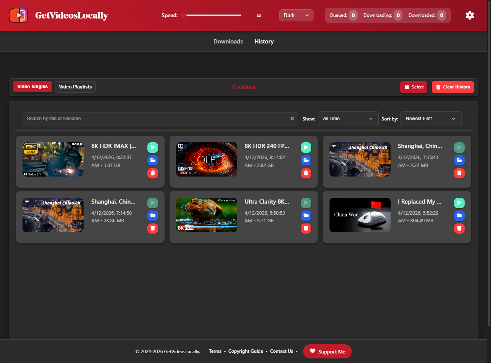

# GetVideosLocally

<div align="center">


**A free desktop app for downloading, processing, and converting videos from 1000+ supported sites, with support up to 8K and the highest bitrate prioritised. An open-source project built out of spite from 4k downloader. Yes I haven't forgotten when i made the one time purchase to be dumped on.**


[](https://opensource.org/licenses/MIT)
[](https://www.microsoft.com/windows)
[](https://www.electronjs.org/)
[](https://github.com/yt-dlp/yt-dlp)

[⭐ Star](https://github.com/FCGLITCHES/simple-yt-downloader) • 
[🐛 Report Bug](https://github.com/FCGLITCHES/simple-yt-downloader/issues) • 
[💬 Discussions](https://github.com/FCGLITCHES/simple-yt-downloader/discussions) • 
[☕ Support](https://fcglitches.github.io/Website-Simple-YTD/#support)

</div>

---

## Quick Start

1. Download from [Releases](https://github.com/FCGLITCHES/simple-yt-downloader/releases)
2. Extract the latest `GetVideosLocally` release package
3. Run `GetVideosLocally.exe` (portable—no installation needed)
4. Paste a video URL and process it

**System Requirements:** Windows 10/11 (64-bit), internet connection, ~200MB disk space

---

## Screenshots

<div align="center">









</div>

---

## Features

### Video & Audio Processing
- Video format conversion and processing
- Supports 1000+ websites
- Audio extraction (MP3, WAV, M4A, OPUS, FLAC)
- **Formats:** MP4, MKV, MOV, WEBM (video) and MP3, WAV, M4A, OPUS, and FLAC (audio)
- **Quality:** 360p to 8K
- **Audio Quality:** 128–320 kbps MP3 options

### Download Control
- **Concurrent downloads** (configurable: 1, 3, or 5 at a time)
- **Speed limiting** to prevent bandwidth hogging
- **Queue management** with progress tracking
- **Pause/Resume** downloads (coming in the next update)
- **Cancel** at any time
- **Real-time progress** with speed and ETA

### User Experience
- **Modern UI** with multiple themes (Light, Dark, Minimal, Vibrant)
- **Download history** with search and filter and folders view for playlists
- **Bulk delete** multiple files or folders
- **Metadata embedding** (thumbnail, chapters)
- **Desktop notifications** and sound alerts
- **Custom download folder**
- **Minimise to system tray** 

### Advanced
- **Authentication support** for content you have permission to access
- **Automatic tool updates** for yt-dlp
- **Duplicate detection** to skip existing files
- **Organized playlists** in separate folders
- **Content filtering** to block inappropriate sites (pornography and gambling)

---

## Installation & Usage

### For End Users

**Windows Download:**
1. Go to [Releases](https://github.com/FCGLITCHES/simple-yt-downloader/releases)
2. Download the latest `GetVideosLocally` package
3. Extract and run `GetVideosLocally.exe`

### Basic Usage
1. Open GetVideosLocally
2. Paste a video URL (using the paste button or keyboard shortcut)
3. Select format (MP4/MP3) and quality
4. Click **Download Now**

### Playlist Processing
1. Paste a playlist URL (playlist detection works with paste button or manual entry)
2. Choose: process selected video only, or entire playlist
3. Set concurrent downloads (reduce if connection is unstable)
4. Start

**Note:** Playlist detection automatically works when pasting URLs using the paste button or when manually typing URLs.

### Authentication
For accessing content you have permission to access:
1. Settings → **Import Cookies**
2. Export `cookies.txt` from your browser (use a "cookies.txt" extension)
3. Upload/paste and save

### Download History
- View all downloads in the History tab
- Filter by type (Singles, Playlists)
- Search by filename
- Sort by date, name, or size
- Bulk delete files

### Settings
- **Performance:** Speed limits, concurrency
- **Appearance:** Themes, UI scale
- **Download Options:** File numbering, duplicate skip
- **Notifications:** Sound, desktop alerts
- **Download Location:** Custom folder

### Content Safety
- **Automatic filtering:** Pornography and gambling sites are automatically blocked
- **Frontend and backend validation:** Protection at multiple levels
- **Clear error messages:** Users are informed when blocked content is detected

---

## Updating Tools

GetVideosLocally checks for yt-dlp updates automatically:
1. Settings → **Update Tools**
2. App checks and installs yt-dlp updates if available

**Note:** FFmpeg updates require manual installation from [https://ffmpeg.org/download.html](https://ffmpeg.org/download.html) if needed.

---

## Troubleshooting

### Downloads Not Starting
- Check internet connection
- Verify URL is correct
- Try updating tools via Settings
- Restart the app
- Check if video is available in your region
- **Note:** Pornography and gambling sites are blocked for safety reasons

### Low Quality Downloads
- Select highest quality option
- Import cookies for content you have permission to access
- Some videos may not have 8K available

### Playlist Downloads Failing
- Reduce concurrent downloads (set to 1)
- Check internet stability
- Reupload cookies if needed
- Some videos may be region-locked or unavailable

### FFmpeg Errors
- Go to Settings → Update Tools
- Re-download FFmpeg from [https://ffmpeg.org/download.html](https://ffmpeg.org/download.html) if needed

### App Won't Start
- Check if another instance is running
- Check Windows Firewall (allow local connections)
- Try running as administrator
- Check console for error messages

### Port Already in Use
- App automatically finds available ports
- If issues persist, restart your computer

---

## Development

### Prerequisites
- **Node.js** 16+ and npm
- **Git**

### Setup
```bash
git clone https://github.com/FCGLITCHES/simple-yt-downloader.git
cd simple-yt-downloader
npm install
```

### Development Commands
```bash
# Run in development mode
npm run electron:dev

# Run server only
npm start

# Build portable package
npm run build:portable

# Build Windows installer
npm run build

# Icon management
npm run icon:generate    # Generate icons
npm run icon:verify      # Verify icon format
npm run icon:verify-exe  # Verify executable icon
```

Output is in `dist/` after building.

### Project Structure
``` 
getvideoslocally/
├── assets/              # Images, sounds, UI assets
├── bin/                 # Bundled executables (yt-dlp, ffmpeg, node)
├── public/              # Static HTML and assets
├── backend/             # Backend modules and services
├── tests/               # Automated tests
├── electron-main.js     # Electron main process
├── server.js            # Backend (Express + WebSocket)
├── script.js            # Frontend logic
├── index.html           # Main UI
├── style.css            # Styles
├── preload.js           # Electron preload
├── package.json
└── README.md
```

### Architecture
- **Main Process:** Application lifecycle, window management, IPC
- **Backend Server:** Express + WebSocket, video processing, yt-dlp/FFmpeg integration
- **Frontend:** UI, WebSocket client, download queue, settings

### Key Implementation Details
- **Concurrency:** `p-limit` library for controlled concurrent downloads
- **Networking:** IPv4 (127.0.0.1) for reliable local connections
- **Port Selection:** Automatically finds available ports
- **Error Handling:** Comprehensive error messages and logging
- **Process Cleanup:** Proper shutdown of all child processes

---

## Contributing

Bug reports and feature requests welcome via [Issues](https://github.com/FCGLITCHES/simple-yt-downloader/issues) and [Discussions](https://github.com/FCGLITCHES/simple-yt-downloader/discussions).

**Ways to help:**
- 🐛 Report bugs
- 💡 Suggest features
- 📝 Improve documentation
- 🌍 Translate UI
- 💻 Code contributions (open an issue first)

**Before contributing:**
- Check existing issues/discussions
- Follow existing code style
- Test changes thoroughly
- Update documentation if needed

**Attribution:** By contributing, you agree your work becomes part of GetVideosLocally with proper credit to [FCGLITCHES](https://github.com/FCGLITCHES).

---

## Support

GetVideosLocally is **free and always will be.**

**Help keep it alive:**
1. ⭐ **Star on GitHub**
2. 🐛 **Report bugs** to improve the app
3. 💬 **Share feedback** and ideas
4. 📢 **Tell others** about GetVideosLocally
5. ☕ **[Buy me a coffee](https://donate.stripe.com/6oU00i73R6eh2yc0oU5AQ00)** (optional)

---

## License

**MIT License** – See [LICENSE](LICENSE) file.

### Third-Party Licenses
- **yt-dlp:** [Unlicense](https://github.com/yt-dlp/yt-dlp/blob/master/LICENSE)
- **FFmpeg:** [LGPL/GPL](https://ffmpeg.org/legal.html)
- **Electron:** [MIT](https://github.com/electron/electron/blob/main/LICENSE)
- Other dependencies: See `package.json`

### Attribution
MIT allows reuse, modification, and redistribution, including forks and commercial use, as long as the copyright notice and license text remain with the project.

If you fork, modify, or redistribute GetVideosLocally, please also keep visible credit in your docs and app credit area linking back to the source repo:
- [FCGLITCHES/simple-yt-downloader](https://github.com/FCGLITCHES/simple-yt-downloader)

Preferred credit examples:
- "Based on GetVideosLocally by [FCGLITCHES](https://github.com/FCGLITCHES/simple-yt-downloader)"
- "Forked from [FCGLITCHES/simple-yt-downloader](https://github.com/FCGLITCHES/simple-yt-downloader)"

---

## Disclaimer

GetVideosLocally is a multi-site video processing tool for 1000+ supported sites. **You are solely responsible for ensuring you have proper authorization and rights** to process any content you use with this software. This includes:

- Obtaining permission from content owners/rightsholders
- Complying with all applicable copyright laws
- Respecting platform terms of service
- Ensuring your use complies with all local laws and regulations

**Use of this software must comply with YouTube's Terms of Service and all other platform terms.** Downloading or processing content without proper authorization may violate terms of service and copyright laws.

Developers are not liable for misuse. This software is provided as-is for lawful use only.

---

## Why GetVideosLocally Exists

**Problem:** Existing video downloaders have limits
- ❌ Force low-quality downloads
- 💰 Paywall high resolutions
- 🗑️ Outdated, unmaintained tools
- 🌐 Browser-based tools with limitations

**Solution:** GetVideosLocally
- ✅ Download best available quality (up to 8K)
- 🆓 100% free, no subscriptions
- 🔄 Built with modern tools (yt-dlp)
- 🖥️ Native desktop app—fast and reliable

---

<div align="center">

**Made with ❤️ by [FCGLITCHES](https://github.com/FCGLITCHES)**

**Video processing and format conversion tools.**

[⭐ Star](https://github.com/FCGLITCHES/simple-yt-downloader) • 
[🐛 Issues](https://github.com/FCGLITCHES/simple-yt-downloader/issues) • 
[💬 Discussions](https://github.com/FCGLITCHES/simple-yt-downloader/discussions) • 
[☕ Support](https://fcglitches.github.io/Website-Simple-YTD/#support)

</div>
